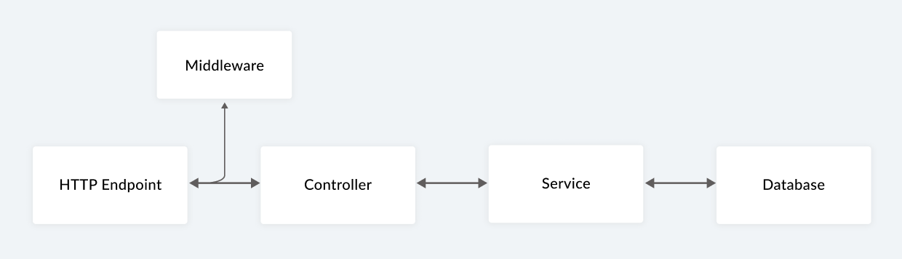
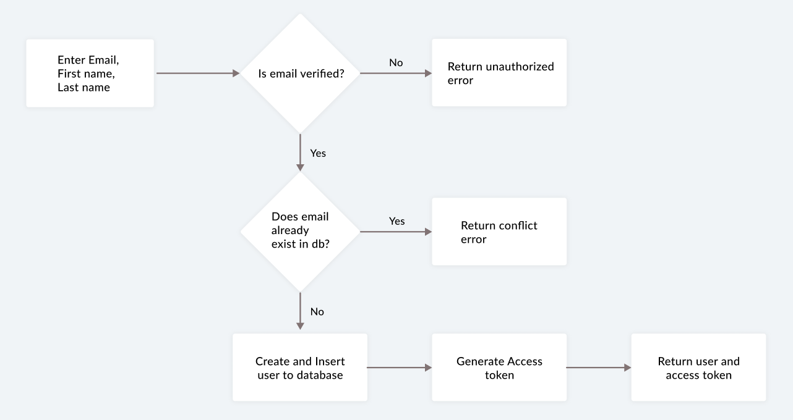

## fluffy-lamp-api

Collection of APIs for a fictional social media app.

## Endpoints

- Enter email and generate OTP
- Verify email and OTP combination
- Register a user
- Add a post
- Update like/dislike for a post
- Add comments to a post
- Read a post by postId
- Read comments for a post by postId
- Delete a post

## Setup instructions

Clone the repo and install the dependencies.

```bash
git clone https://github.com/valeyellow/fluffy-lamp-api.git
cd fluffy-lamp-api
```

```bash
npm install
```

Add a .env file (sample .env file with required variables is added to the repo)

Setup OAuth on your gmail

Learn how to setup nodemailer with gmail using OAuth https://www.freecodecamp.org/news/use-nodemailer-to-send-emails-from-your-node-js-server/

## Run the server

To start the express server, run the following

```bash
npm run start
```

## Test the connection locally

To test if the app is running, run the following

```bash
curl http://localhost:<PORT>/healthcheck
```

returns "Connection successful!" upon successful connection

## Deployment

App is running on https://fluffy-lamp.herokuapp.com/

The app is deployed on Heroku platform, and the database is hosted on MongoDB Atlas

Read more about deploying apps to Heroku https://devcenter.heroku.com/categories/deployment

## Data flow



## Sign up flow



## Verify OTP flow


## CRUD actions flow


