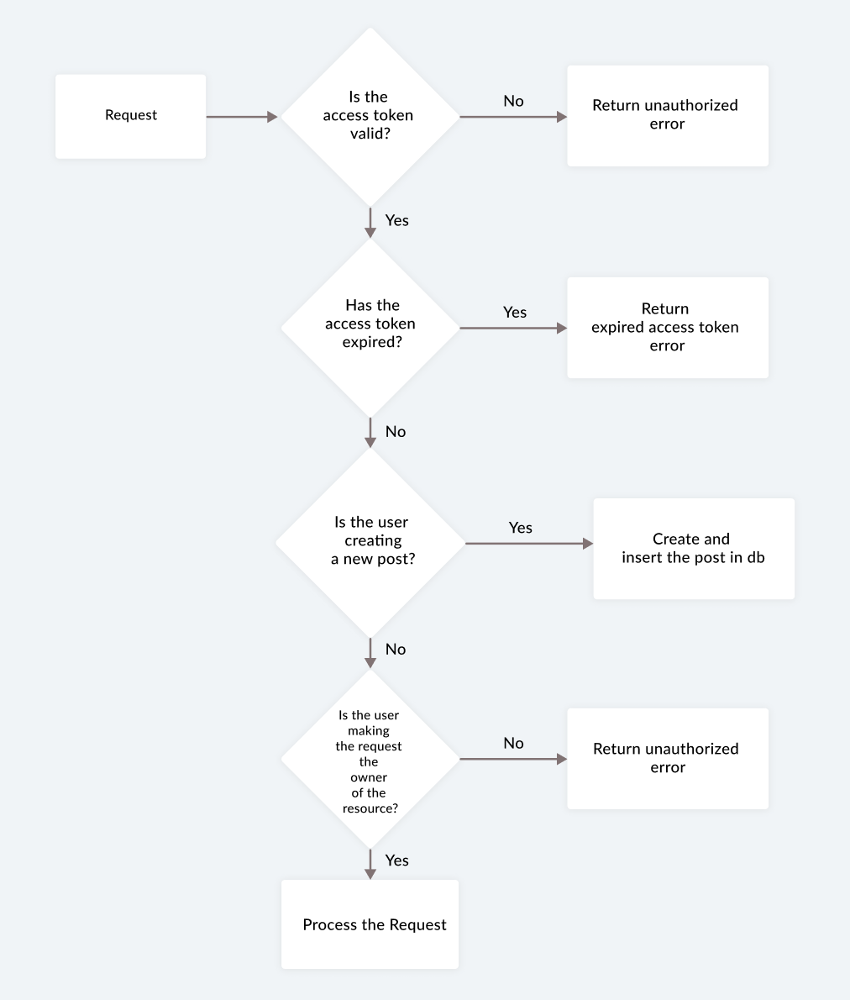

## Setup instructions

Clone the repo and install the dependencies.

```bash
git clone https://github.com/valeyellow/fluffy-lamp-api.git
cd fluffy-lamp-api
```

```bash
npm install
```

Add a .env file

# .env.sample

```bash
NODE_ENV=<production|development>
PORT=<open-port>
API_KEY=<github-key>
DB_URI=<local-mongodb-uri>
PUBLIC_KEY=<public-rsa-key>
PRIVATE_KEY=<public-rsa-key>
ACCESS_TOKEN_TTL=<access-token-time-to-live>
EMAIL_USERNAME=<email-address-to-be-used-by-nodemailer>
EMAIL_PASSWORD=<password-for-above-email>
OAUTH_CLIENTID=<generate-this-using-google-oauth>
OAUTH_CLIENT_SECRET=<generate-this-using-google-oauth>
OAUTH_REFRESH_TOKEN=<generate-this-using-google-oauth>
```

Learn how to setup nodemailer with gmail using OAuth https://www.freecodecamp.org/news/use-nodemailer-to-send-emails-from-your-node-js-server/

## Run the server

To start the express server, run the following

```bash
npm run start
```

## Test the connection locally

To test if the app is running, run the following

```bash
curl http://localhost:<PORT>/healthcheck
```

returns "Connection successful!" upon successful connection

## Data flow


## Sign up flow


## Verify OTP flow


## CRUD actions flow


