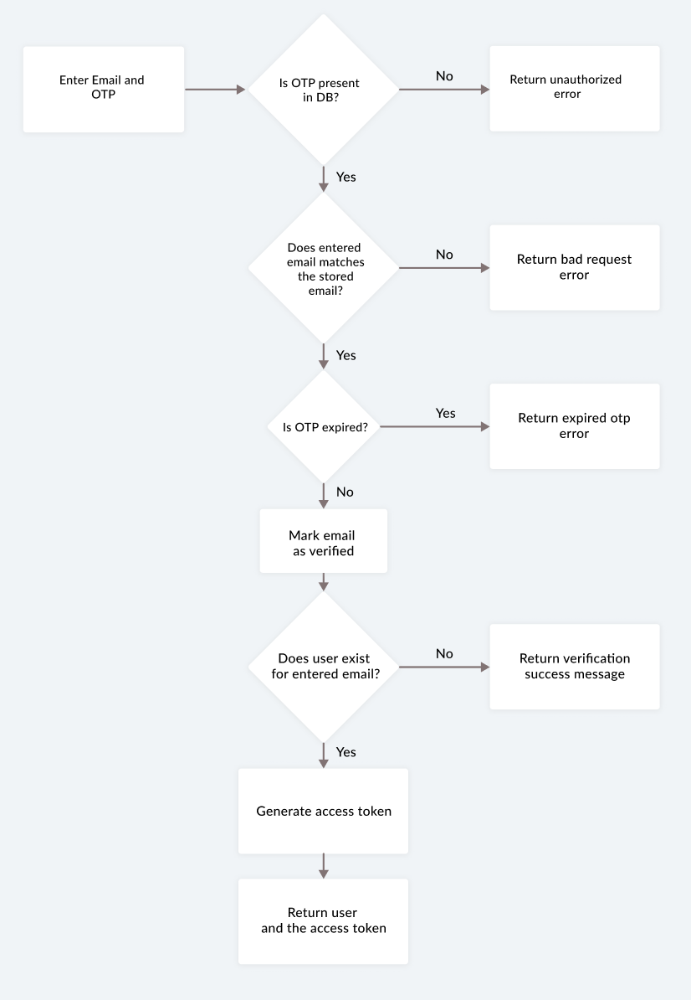

## Setup instructions

Clone the repo and install the dependencies.

```bash
git clone https://github.com/valeyellow/fluffy-lamp-api.git
cd fluffy-lamp-api
```

```bash
npm install
```

## Run the server

To start the express server, run the following

```bash
npm run start
```

## Data flow


## Sign up flow


## Verify OTP flow



## CRUD actions flow


